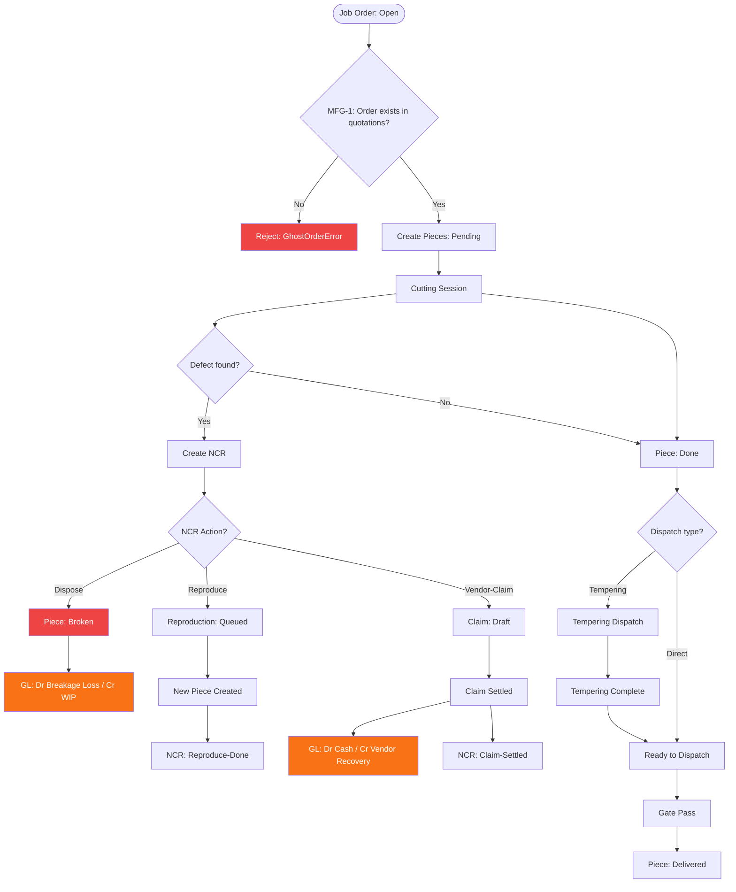

# Cutting / Production Module — Data Flow Diagram

**Files:** productionService.ts, ncrService.ts, productionCostService.ts
**Tables:** production_pieces, job_orders, cutting_sessions, ncr_events, ncr_claims, ncr_reproductions, gate_passes, tempering_dispatches
