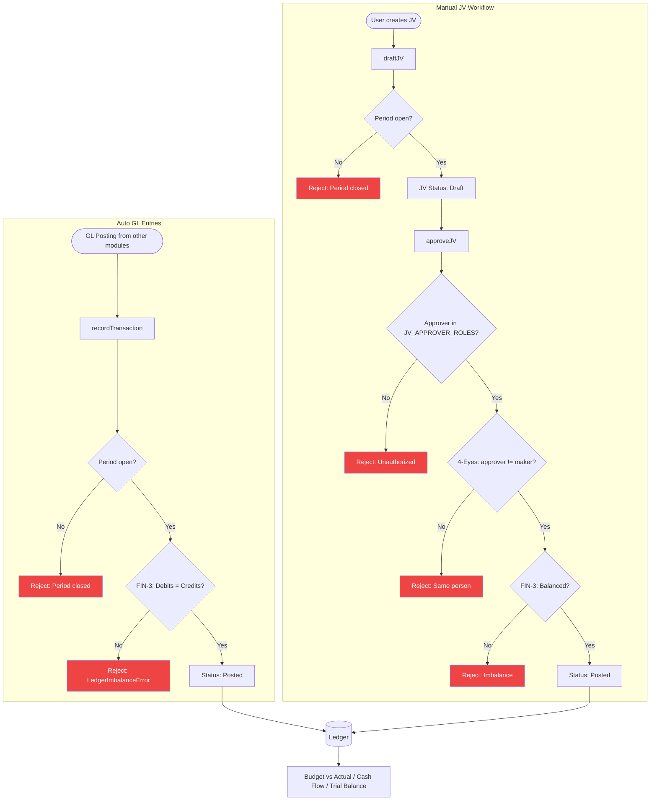

# Finance Module — Data Flow Diagram

**Files:** financeService.ts, budgetService.ts, cashFlowService.ts, periodService.ts
**Tables:** ledger, accounts, cost_centers, fiscal_periods, budget_lines, gl_posting_rules, petty_cash, recurring_expenses, asset_registry
