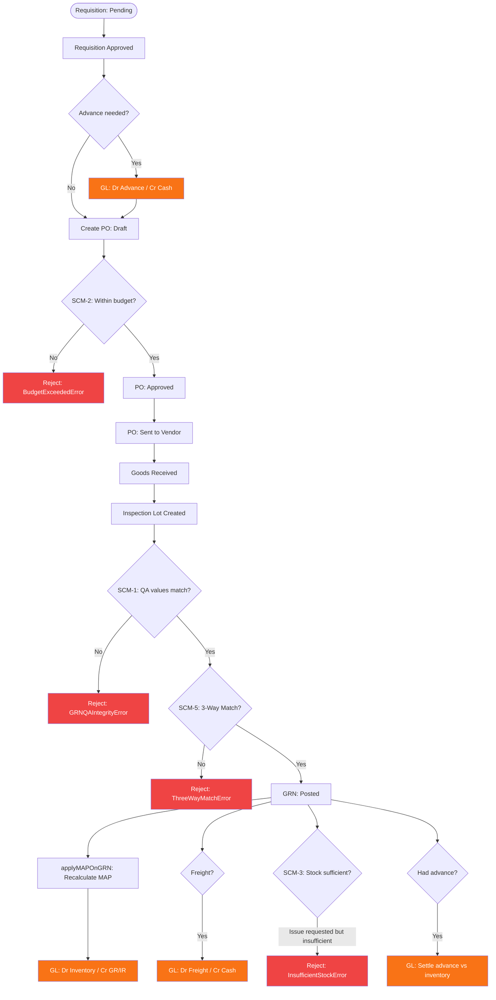

# Procurement Module — Data Flow Diagram

**Files:** inventoryService.ts, grnService.ts, grnGLService.ts, glasscoGLService.ts
**Tables:** requisitions, purchase_orders, grn_sheet_entries, store_items, stock_ledger, inspection_lots, handling_units
