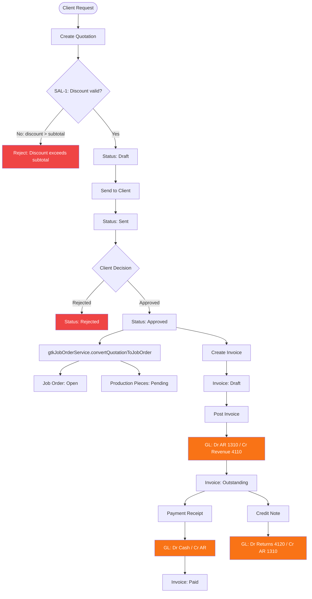

# Sales Module — Data Flow Diagram

**Files:** salesService.ts, gtkJobOrderService.ts, deliveryInvoiceService.ts, creditNoteService.ts
**Tables:** quotations, clients, invoices, payment_receipts, projects
