# Module Dependency Graph — GlassTech ERP

**Extracted from:** Actual codebase imports, service calls, and Supabase foreign keys
**Date:** 2026-04-14

## Dependency Graph (Mermaid)

```mermaid
graph TD
    classDef ui fill:#3b82f6,color:white
    classDef service fill:#22c55e,color:white
    classDef data fill:#a855f7,color:white
    classDef gl fill:#f97316,color:white
    classDef agent fill:#06b6d4,color:white
    classDef circular fill:#ef4444,color:white

    %% ── UI Layer ──────────────────────────────────────
    SALES_UI[Sales UI]:::ui
    PROC_UI[Procurement UI]:::ui
    PROD_UI[Production UI]:::ui
    FIN_UI[Finance UI]:::ui
    HR_UI[HR UI]:::ui
    FACTORY_UI[Factory/Agent UI]:::ui

    %% ── Service Layer ─────────────────────────────────
    SalesSvc[salesService.ts]:::service
    InvSvc[inventoryService.ts]:::service
    GRNSvc[grnService.ts]:::service
    ProdSvc[productionService.ts]:::service
    NCRSvc[ncrService.ts]:::service
    FinSvc[financeService.ts]:::gl
    HRSvc[hrService.ts]:::service
    ProjSvc[projectService.ts]:::service
    AgentSvc[claudeAgentService.ts]:::agent

    %% ── GL Posting Services ───────────────────────────
    GRNGL[grnGLService.ts]:::gl
    GlassGL[glasscoGLService.ts]:::gl
    InvGL[deliveryInvoiceService.ts]:::gl
    CreditGL[creditNoteService.ts]:::gl
    ProdCost[productionCostService.ts]:::gl
    ICOSvc[intercompanyService.ts]:::gl

    %% ── Data Layer ────────────────────────────────────
    SupaDB[(Supabase 96 tables)]:::data
    LocalS[(localStorage cache)]:::data

    %% ── UI → Service ──────────────────────────────────
    SALES_UI --> SalesSvc
    PROC_UI --> InvSvc
    PROC_UI --> GRNSvc
    PROD_UI --> ProdSvc
    PROD_UI --> NCRSvc
    FIN_UI --> FinSvc
    HR_UI --> HRSvc
    FACTORY_UI --> AgentSvc

    %% ── Service → GL (ORANGE touch points) ────────────
    GRNSvc -->|GRN posted| GRNGL
    GRNSvc -->|GlassCo pieces| GlassGL
    SalesSvc -->|Invoice posted| InvGL
    SalesSvc -->|Credit note| CreditGL
    NCRSvc -->|Breakage write-off| FinSvc
    NCRSvc -->|Vendor claim settled| FinSvc
    ProjSvc -->|Project cost/revenue| FinSvc
    ProdCost -->|Labour/overhead| FinSvc

    %% ── GL Services → Finance Hub ─────────────────────
    GRNGL -->|Dr Inventory Cr GR/IR| FinSvc
    GlassGL -->|MAP-based GL| FinSvc
    InvGL -->|Dr AR Cr Revenue| FinSvc
    CreditGL -->|Dr Returns Cr AR| FinSvc
    ICOSvc -->|Dual-company GL| FinSvc

    %% ── Cross-Module Dependencies ─────────────────────
    SalesSvc -->|Approved quotation| ProdSvc
    ProdSvc -->|Stock check| InvSvc
    GRNSvc -->|QA gate| InvSvc
    GRNSvc -->|3-way match| SalesSvc
    HRSvc -->|Loan requisition| InvSvc
    InvSvc -->|Budget check| FinSvc

    %% ── Agent reads all ───────────────────────────────
    AgentSvc -.->|reads| SalesSvc
    AgentSvc -.->|reads| ProdSvc
    AgentSvc -.->|reads| InvSvc
    AgentSvc -.->|reads| FinSvc
    AgentSvc -.->|reads| HRSvc

    %% ── Data Layer ────────────────────────────────────
    SalesSvc --> SupaDB
    SalesSvc --> LocalS
    InvSvc --> SupaDB
    InvSvc --> LocalS
    ProdSvc --> SupaDB
    ProdSvc --> LocalS
    FinSvc --> LocalS
    HRSvc --> SupaDB
```



## Circular Dependency Analysis

**No circular dependencies found.** All module dependencies flow in one direction:

```
UI → Service → GL Service → FinanceService → Data Layer
```

The only potential cycle is:
- `GRNSvc` calls `SalesSvc` (for 3-way match invoice lookup)
- `SalesSvc` does NOT call `GRNSvc`

This is a **read-only dependency**, not a circular call.

## GL Touch Point Summary (ORANGE nodes)

| GL Service | Trigger | Debit | Credit |
|---|---|---|---|
| grnGLService | GRN posted | Inventory | GR/IR Clearing |
| grnGLService | Freight | Payable/Expense | Cash |
| glasscoGLService | GlassCo pieces | MAP-based | Material |
| deliveryInvoiceService | Invoice posted | Accounts Receivable | Sales Revenue |
| creditNoteService | Credit note | Sales Returns | Accounts Receivable |
| ncrService | Breakage dispose | Breakage Loss | WIP Glass |
| ncrService | Vendor claim | Cash | Vendor Recovery |
| productionCostService | Labour/overhead | WIP | Payroll/Overhead |
| intercompanyService | ICO settlement | ICO Payable | Cash (dual-company) |
| projectService | Project cost | WIP | Project AP |

## Module Count

| Layer | Count | Modules |
|---|---|---|
| UI | 6 | Sales, Procurement, Production, Finance, HR, Factory |
| Service | 9 | salesService, inventoryService, grnService, productionService, ncrService, financeService, hrService, projectService, claudeAgentService |
| GL Posting | 6 | grnGL, glasscoGL, deliveryInvoice, creditNote, productionCost, intercompany |
| Data | 2 | Supabase (96 tables), localStorage (60+ keys) |
| Company-specific | 4 | GlassCo, GTK, GTI, Nippon |
